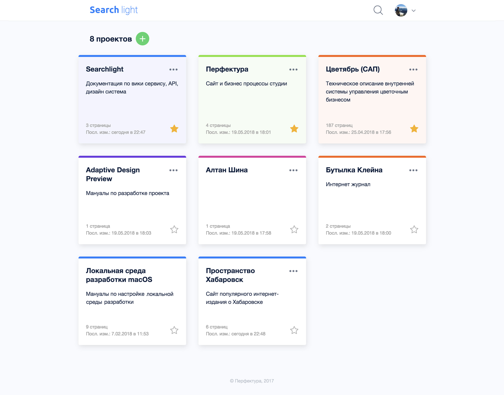
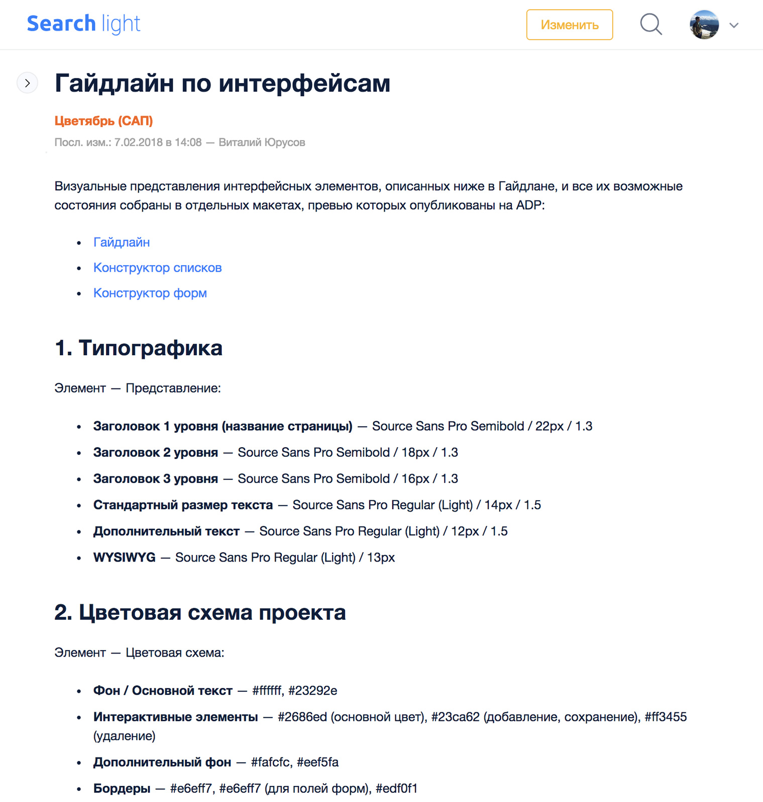
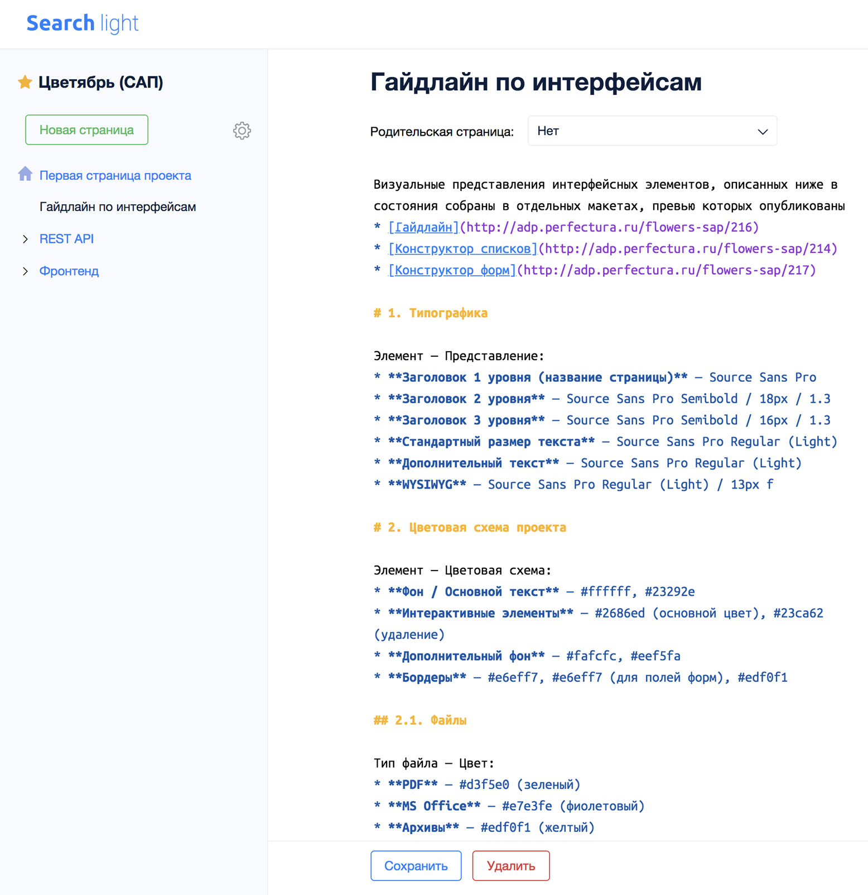
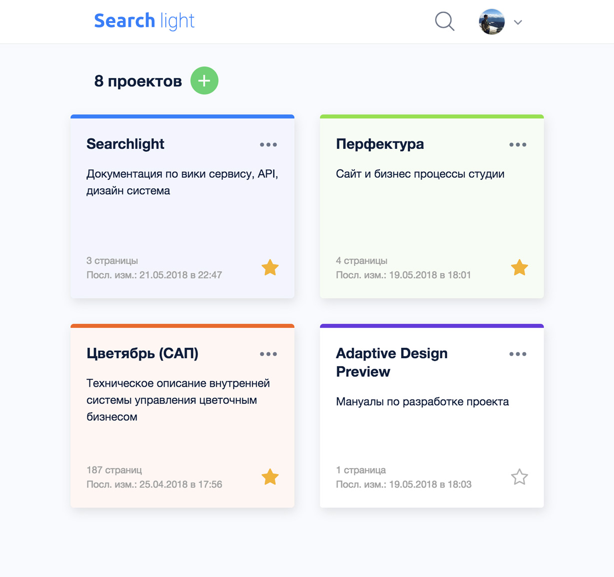
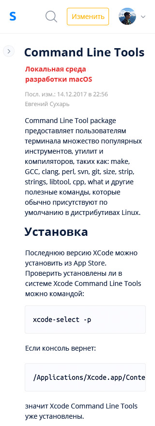

# searchlight

**ЗАДАЧА:** Сделать систему для ведения студийной документации с возможностью
дальнейшей доработки до уровня продукта.  

**ТЕХНОЛОГИИ:**

* **Фронт:** vue.js + vuex

* **бэк:** Django + drf

**СУДЬБА ПРОЕКТА:** На начало 2019 сервис работал как хранилище документации по проектам студии.

* Дашборд проектов ([Этот компонент в качестве примера](1.Searchlight/code_example.vue))

* Страница проекта

* Страница Проекта с открытым сайдбаром

Также имеется система поиска которая позволяет искать страницы по названию проекта, 
названию страницы, а также контенту страницы

* Страница с результатами поиска

При этом вся система полностью адаптивна для всех актуальных мобильных устройств

* Дашборд для средних экранов

* Дашборд для мобилок

* Страница проекта для мобилок

