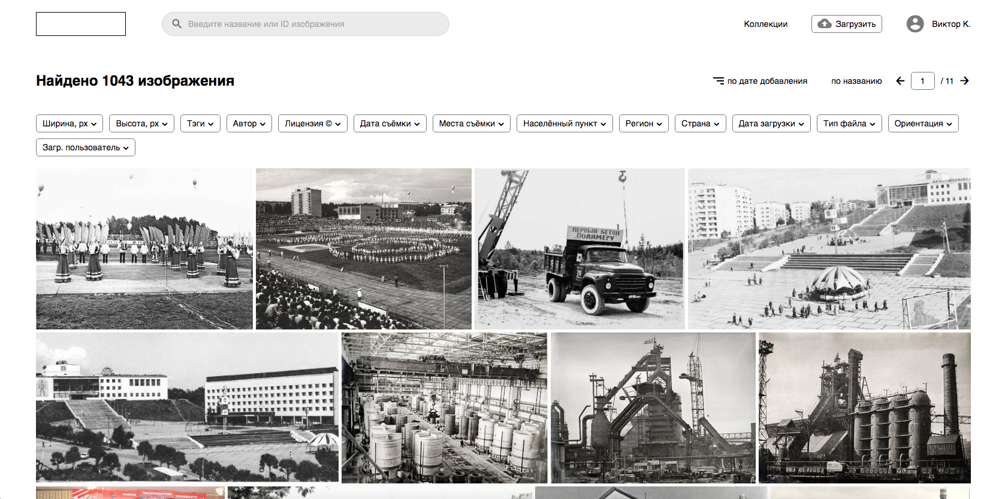
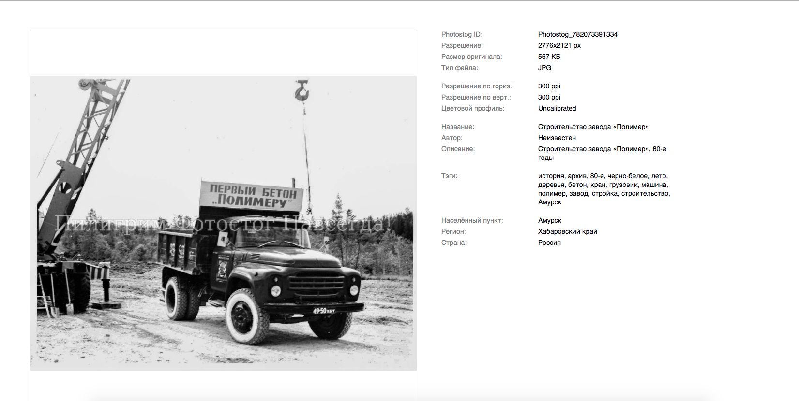

# PHOTOSTOG

**ЗАДАЧА:** Сделать систему для хранения снимков фото-студии, 
доступ к которым будет максимально удобен.

**ТЕХНОЛОГИИ:**

* **Фронт:** vue.js + vuex

* **бэк:** Django + drf

**СУДЬБА ПРОЕКТА:** Проект успешно внедрен и применяется заказчиком по назначению. 
После завершения разработки был заказан дополнительный функционал в виде гостевых
аккаунтов, которые имеют доступ к только определённым категориям снимков.

# Описание

По условиям контракта дизайном должна была заниматся сторонняя студия, поэтому 
представленный ниже дизайн является прототипом. При этом система полностью функциональна.

**Главная страница**

На этой странице можно увидеть все доступные пользователю изображения. 
Можно выбрать необходимые фильтры и настроить сортировку. 

---

**Главная страница с активными фильтрами**

На данном скрине можно увидить выпадающее меню фильтрации по тегам.

---

**Страница изображения**

Большинство элементов интерактивно и при нажатии на них пользователь перенаправляются на главную
с применением выбранного фильтра.

---

**Страница редактирования/загрузки изображения**

---

**Страница печати изображения**

Любое изображение можно распечатать со всей необходимой информацией (Выбирается в попапе 
перед отправкой на печать).

