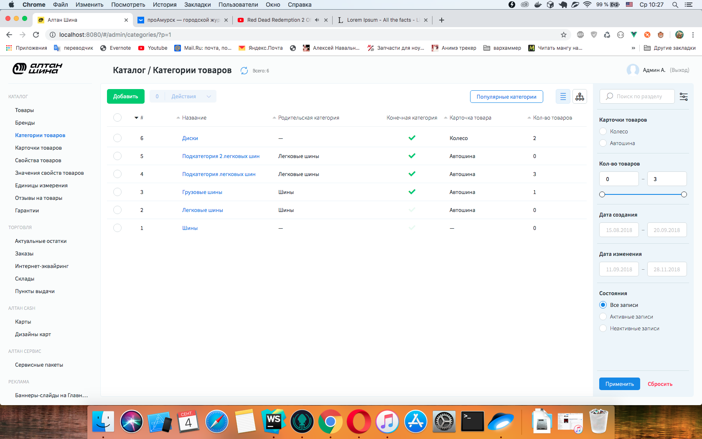
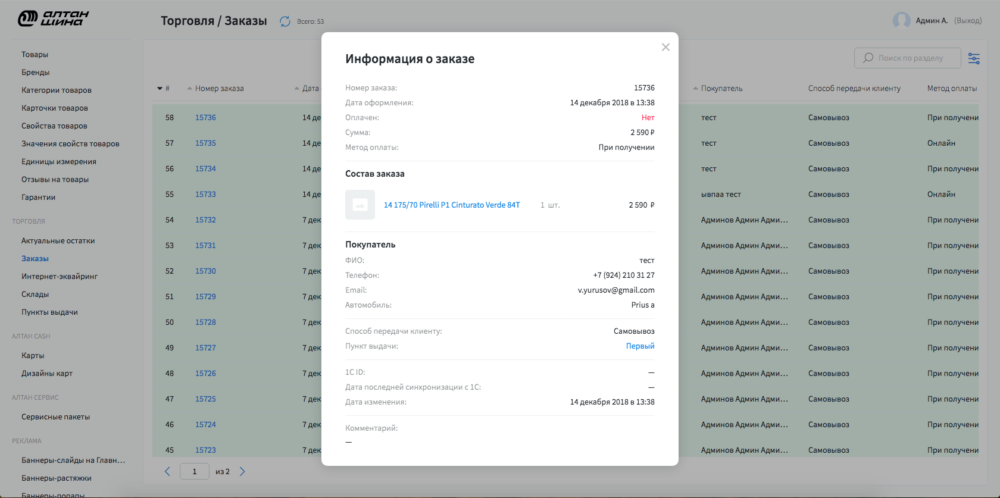
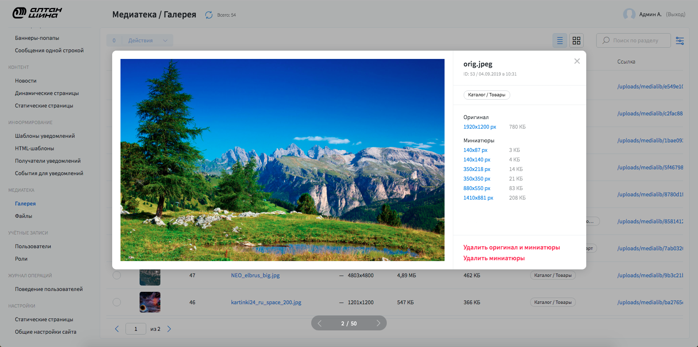
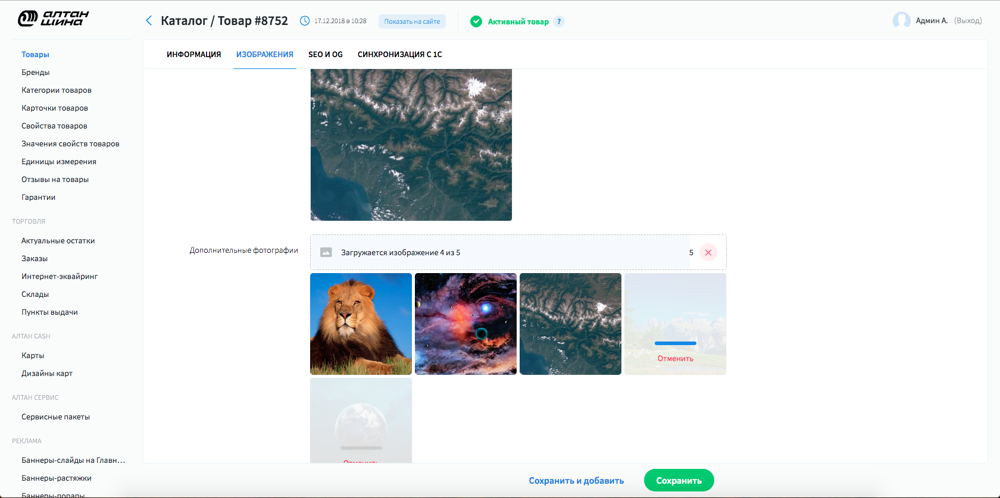

# CMS for Perfectura

**GOAL:** Create a cms system for perfectura web studio. 
It should be run by configs and expendable for any project. 

**TECHNOLOGIES:**

* **frontend:** vue.js + vuex

* **backend:** Django + drf

**RESULT:** This system is used by Perfectura for over a year now.

# Description

**List interface**

This is the main interface. it includes controls like Delete, Activation/Deactivation required 
to interact with entities. Everything you might need for correct representation like sorts and filters.
If pressed on entity there are 2 cases: 1 - redirect to entity form, 
2 - if it doesn't have form, special popup with detailed information will be rendered.

Everything you see here is rendered by configuration file. check it 
[here.](/3.Perfectura_cms/code_examples/configs/list_config.js)

---

**Detailed information popup**

On these particular project, all orders are obtained from accountant system, that's why
we can't manipulate order data but just get detail information.

---

**Custom list interface for image store**

Unlike other cases, clicking on entity at this interface is render special popup with image
viewer with controls.

---

**Form interface**

Here you can see form interface by which adding/editing operations are made. Just as list interface
form is rendered by using [config file.](/3.Perfectura_cms/code_examples/configs/form_config.js)

---

**Image upload widget example**

---

### Also there is special plugin to work with news sites made by me. more [here](/3.Perfectura_cms/en/post_editor).