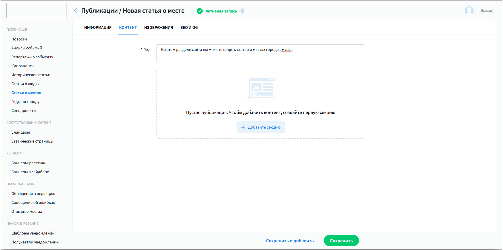
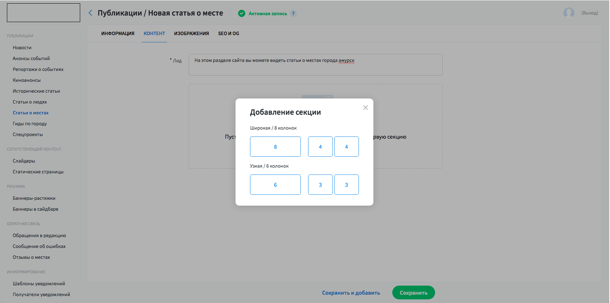
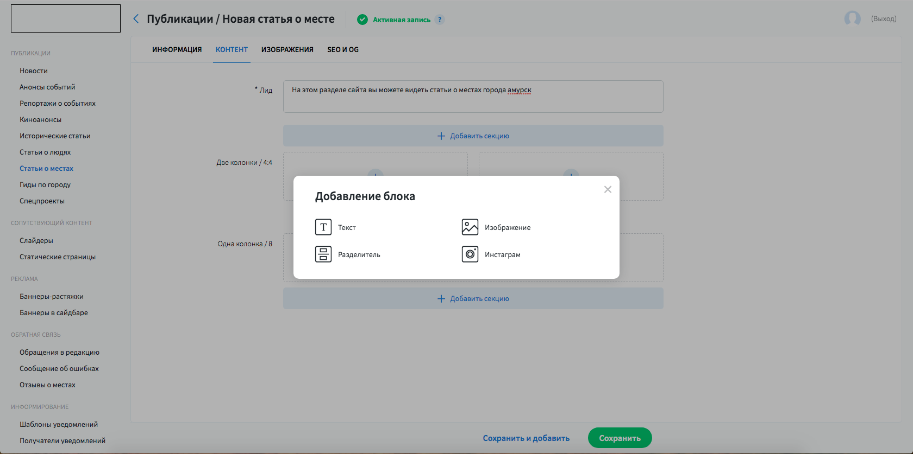
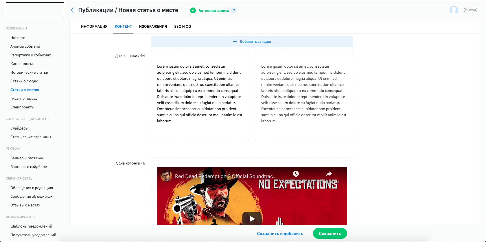
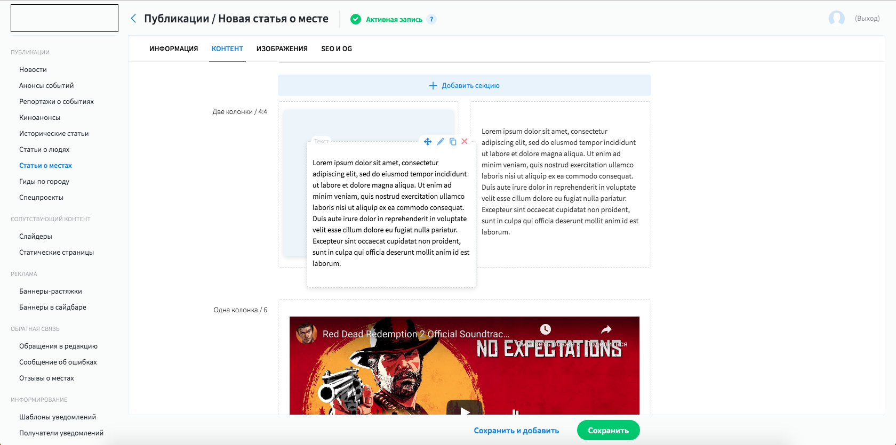

# Post editor

This is a special plugin for cms that let comfortably operate with news cites.

---

**Default state**

This plugin is just extension for form interfaces. At default state it looks like this.
First of all you need to create a section.  

---

**Picking section size**

All proportions are listed in a simple config, required css sizes are calculated automatically.
[Check config here.](/3.Perfectura_cms/code_examples/configs/posteditor_config.js) 

---

**Marked sections**

After sections being marked, you can start to add content.

---

**Widget picking popup**

Available widgets are listed in config above. System is easy to expand by adding new widgets. 

---

**Filled article example**

---

**Drag&Drop example**

Также есть возможность скопировать и вставить виджеты и сами секции.

At any moment widgets can be draged between sections (if section can accept that type of widget).
Sections also can be dragged between each other. Copy-paste system for all elements is also included.

---

## check [article](https://proamursk.ru/news/104/) made by this plugin. 