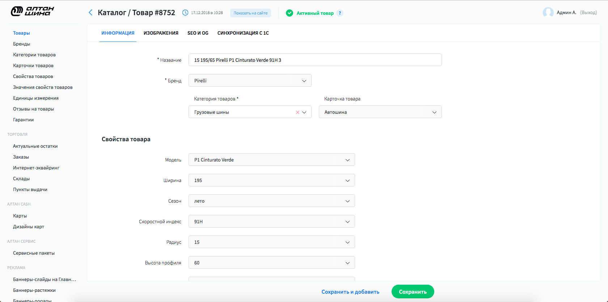

# CMS for Perfectura

**GOAL:** To create a cms system for perfectura web studio. 
It should be run by configs and be expendable for any project. 

**TECHNOLOGIES:**

* **frontend:** vue.js + vuex

* **backend:** Django + drf

**RESULT:** This system is used by Perfectura for over a year now.

# Description

[screencast on youtube](https://www.youtube.com/watch?v=52UBgQ-nYKI)

**List interface**

This is the main interface. it includes controls like Delete, Activation/Deactivation required 
to interact with entities and everything you might need for correct representation like sorts and filters.
If pressed on entity there are 2 cases: 

1 - redirect to entity form;

2 - if it doesn't have form, special popup with detailed information will be rendered;

Everything you see here is rendered by configuration file. check it 
[here.](/english/1.perfectura_cms/code_examples/configs/list_config.js)

---

**Detailed information popup**

On these particular project, all orders are obtained from accountant system, that's why
we can't manipulate order data but just able to see detail information.

---

**Form interface**

Here you can see form interface by which adding/editing operations are made. Just as list interface
form is rendered by using [config file.](/english/1.perfectura_cms/code_examples/configs/form_config.js)

---

**Image upload widget example**

---

### Also there is special plugin to work with news sites made by me. more [here](/english/1.perfectura_cms/post_editor).
