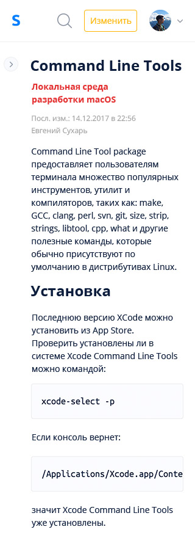

# SEARCHLIGHT

**GOAL:** Create service for internal documentation with an opportunity to evolve it to product state.

**TECHNOLOGIES:**

* **Frontend:** vue.js + vuex

* **Backend:** Django + drf

**RESULT:** At the start of service was working as documentation store for studio projects.
# Description

**Projects dashboard ([See this component as a code example](/english/2.searchlight/code_example.vue))**

The main service entity is _project_. Project has _pages_.

---

**Project page**

Document is consist of styled text written by using markdown language.
_Project_ consists of _pages_ with its on hierarchy

---

**Project page with opened sidebar**

---

**Page with search results**

Service has search system that can search by project name, page name, page content

---

Every interface is adapted for different kinds of displays

**Dashboard for medium size display**

**Dashboard for mobile devices**

**Project page for mobile devices**

