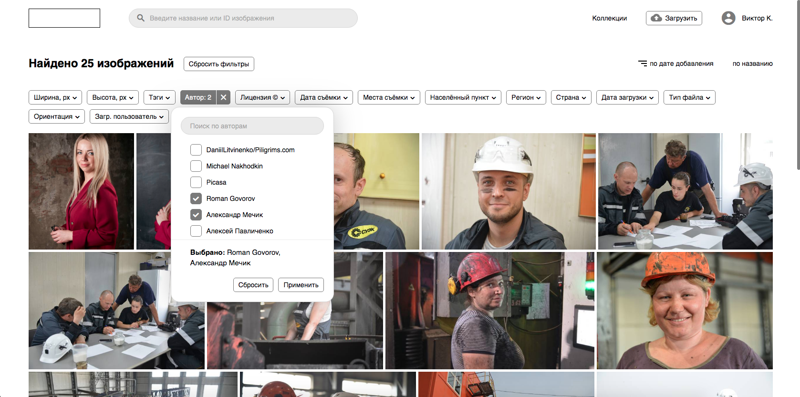

# PHOTOSTOG

**GOAL:** Create a system that lets store image database of photo studio. 
Work with store should be intuitive.

**TECHNOLOGIES:**

* **frontend:** vue.js + vuex

* **backend:** Django + drf

**RESULT:** System is successfully introduced and being used by customer.

[Screencast on youtube](https://www.youtube.com/watch?v=w8igLTV37rM)

# Description

By contract terms third party studio is engaged in design, but they failed. 
Everything you see here is made with prototyped design. System is fully functional though.

**Main page**

Here you can see all images available for a user, 
also you can pick filters and enable sorting.

---

**Main page with active filters**

Here you can see a dropdown menu with tags filters.

---

**Image page**

Most elements on a page are interactive. After clicking on it user is redirected to main page
with certain filters enabled. 

---

**Image load/edit page ([this component as an example](/english/3.photostog/code_example.vue))**

---

**Image print page**

Every image can be printed with all its information 
(can be picked separately at popup before print).

