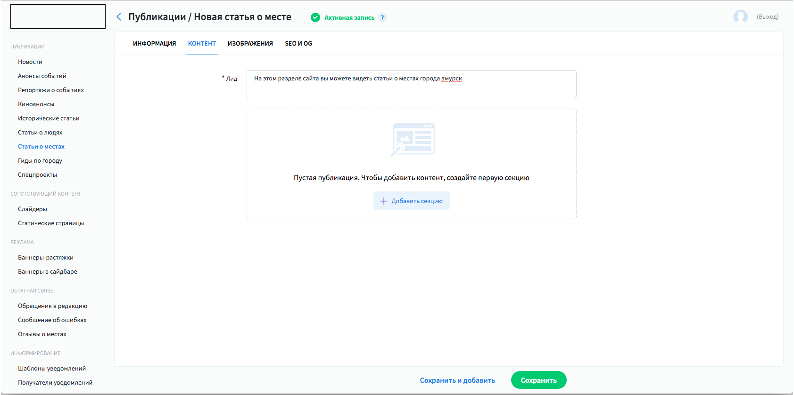
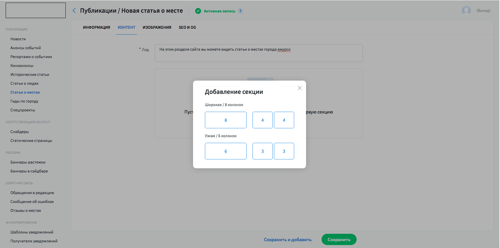
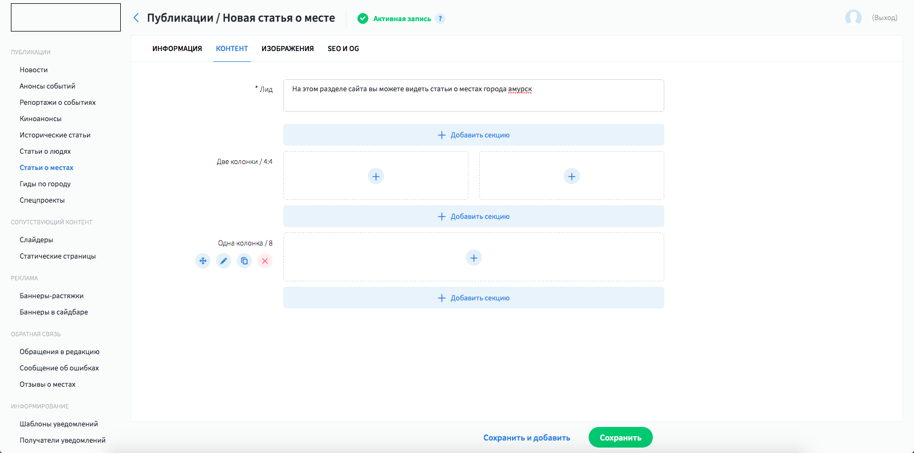
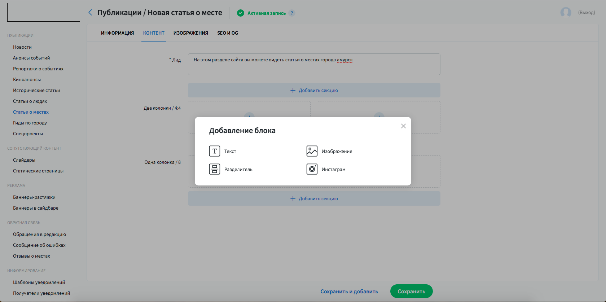
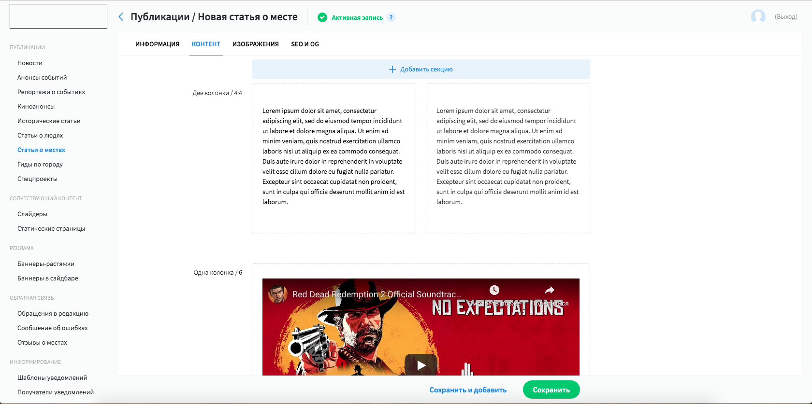
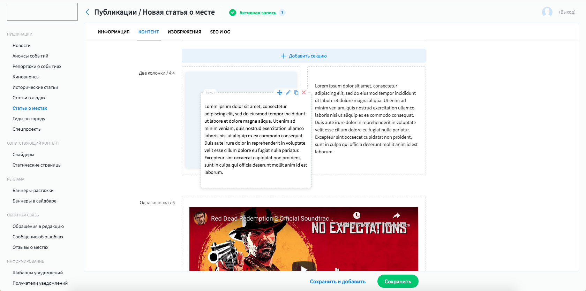

# Post editor

Это специальное расширения для cms системы, которое позволяет удобно управлять наполнением 
новостных сайтов.

[Скринкаст на youtube](https://www.youtube.com/watch?v=Ciw5GkmsGp8)

---

**Состояние по умолчанию**

Плагин представляет собой расширение для интерфейса форм 
который в начальном состоянии выглядит вот так. Для начала необходимо создать секцию.

---

**Выбор размеров секции**

Все размеры задаются через простейший конфиг. Все размеры представления высчитываются автоматически.

[Пример файла конфигурации](/russian/1.perfectura_cms/code_examples/configs/posteditor_config.js) 

---

**Размеченные секции**

После разметки секций можно начинать добавлять конент.

---

**Попап с выбором виджета**

Доступный выбор зависит от настроек [конфига](/russian/1.perfectura_cms/code_examples/configs/posteditor_config.js), 
в частности от размеров секции.

---

**Пример заполненой статьи**

Систему можно легко расширять дополнительными виджетами. Мною был реализован минимальный набор для 
новостного сайта.

---

**Пример работы drag&drop**

В любой момент виджет можно перетянуть из одной секции в другую. Главное чтобы она подходила по размеру.
Также есть возможность скопировать и вставить виджеты и сами секции.

---

## Одна из публикаций сайта [proamursk.ru](https://proamursk.ru/news/104/) которая написана с помощью данного плагина. 
