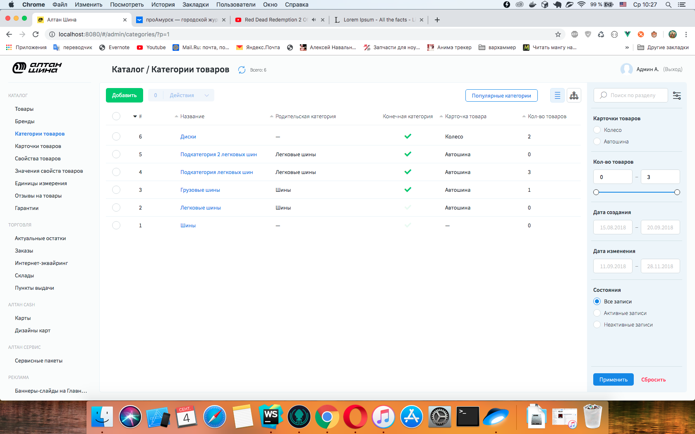
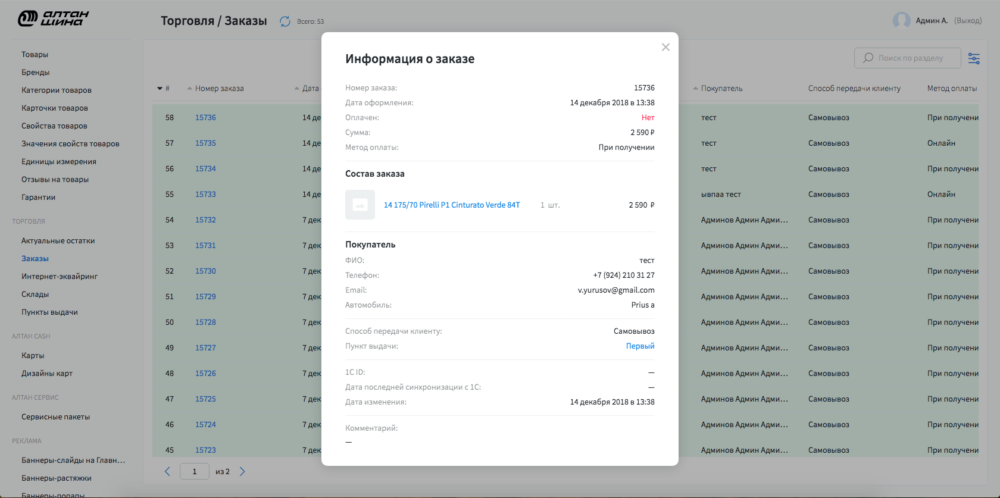
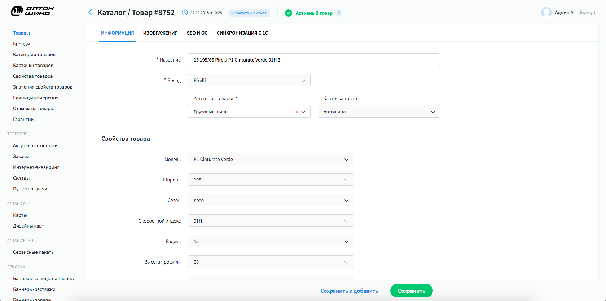
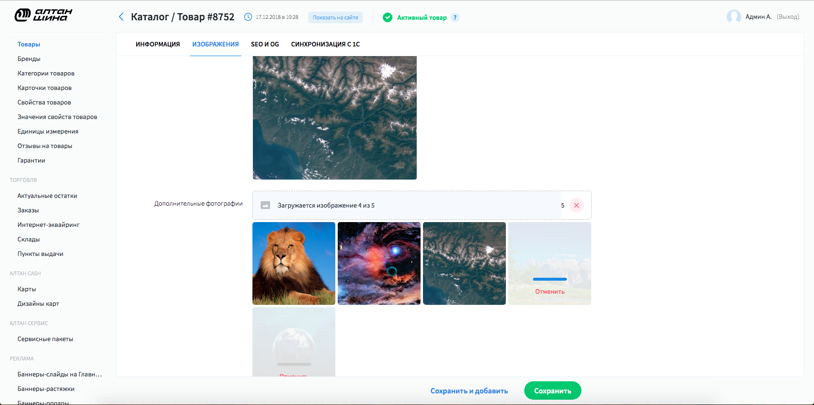
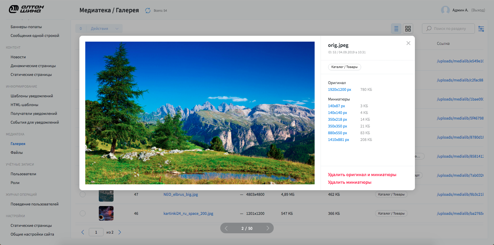

# CMS для студии Perfectura

**ЗАДАЧА:** Сделать cms систему для проектов студии. Система должна быть легко конфигурируема
и расширяема под любые проекты.

**ТЕХНОЛОГИИ:**

* **Фронт:** vue.js + vuex

* **бэк:** Django + drf

**СУДЬБА ПРОЕКТА:** Данная CMS система применяется для всех проектов студии уже около года.

# Описание

[Скринкаст на youtube](https://www.youtube.com/watch?v=52UBgQ-nYKI)

**Списочный интерфейс**

Основной интерфейс системы. Здесь имеются все необходимые инструменты для работы с существующими сущностями.
Удаление, активация/деактивация. Также имеются все необходимые инструменты для представления данных - 
сортировки и фильтрации. При нажатии на запись может произойти 2 действия: переход на форму сущности 
или, если данные приходят из стороннего источника, попап с подробной информацией.

Всё что вы видите на данном скрине генерируется исходя из конфига. 
[Пример файла конфигурации](/russian/old/1.perfectura_cms/code_examples/configs/list_config.js)

---

**Попап с подробной информацией о заказе**

На данном проекте все заказы оформляются через 1С, и поэтому в админке у них нет форм, можно только
посмотреть подробную информацию. 

---

**Интерфейс формы**

Здесь можно увидеть интерфейс формы, с помощью которого осуществляется создание/редактирование 
сущностей. Форма собирается из множества виджетов, порядок которых прописан в
[файле конфигурации](/russian/old/1.perfectura_cms/code_examples/configs/form_config.js).

---

**Пример работы виджета загрузки изображений**

---

**Кастомный списочный интерфейс для хранилища изображений**

Данный интерфейс был измененём для того чтобы при клике на сущность появлялся слайдер с картинками в
котором есть все необходимые контролы для работы с записью.

---

### Незадолго до моего ухода из компании я сделал специальное расширение для работы с новостными сайтами. подробнее [здесь](/russian/old/1.perfectura_cms/post_editor).
